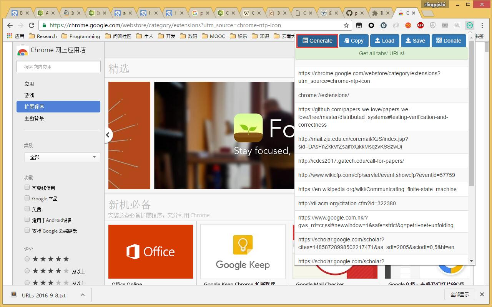
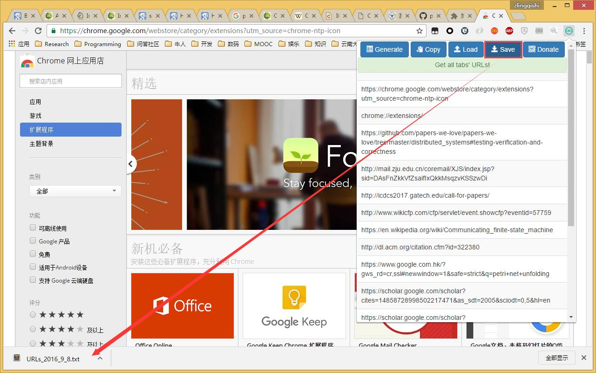

# EasyTabURL-ChromeExtension
Help you operate tabs' url more conveniently

## Features
- get all tabs' urls
- copy all tabs' urls to clipboard(Chrome only!)
- save all tabs' urls to local file
- read local file and open all urls in the file(file generated from 'save' function)

## Screenshots

## Todo
- [x] fix wrong month in saved file's name bug [Issue #1](https://github.com/coder-chenzhi/EasyTabURL-ChromeExtension/issues/1)
- [ ] change extension description, give more detail for what this extension can do
- [ ] add tab titles
- [x] adjust popup window's height according to the table's height until reach the max height
- [ ] add paypal donation and change donation approach automatically according to users' location [Issue #2](https://github.com/coder-chenzhi/EasyTabURL-ChromeExtension/issues/2)